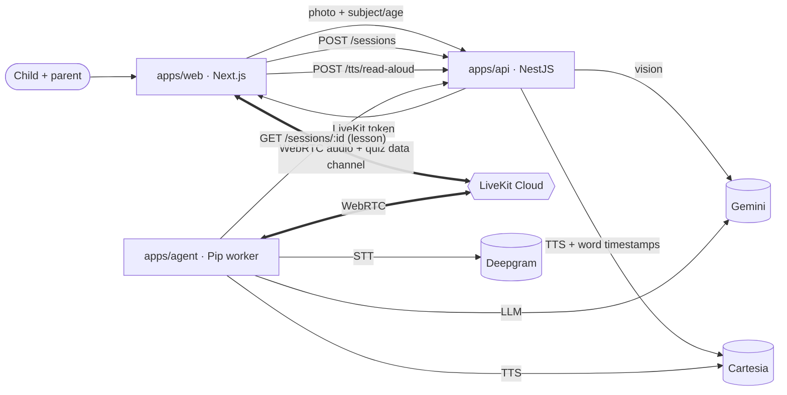

# Curio

**A voice-first study tutor for children aged 8–10.** A child (or parent) takes
a photo of a school lesson; Curio extracts the key concepts; then an AI tutor
named **Pip** runs a short spoken quiz — asking questions out loud, listening to
the child's spoken answers, giving warm feedback, and tracking progress on a
visual scorecard.

Curio is **voice-first by design**: the quiz happens by listening and speaking,
not reading and writing. This sidesteps the core decoding barrier of dyslexia
and meets young children where they are, regardless of reading fluency. See
[`Constitution.md`](./Constitution.md) for the principles that guide every
decision, and [`MVP.md`](./MVP.md) for the full spec.

## Architecture



- **`apps/web`** (Next.js 16 / React 19) — capture → review → quiz screens.
- **`apps/api`** (NestJS 11) — vision (`/lessons`), session + LiveKit token
  minting (`/sessions`), mock auth (`/auth/login`), read-aloud (`/tts/read-aloud`).
- **`apps/agent`** (`@livekit/agents` worker) — "Pip", the cascaded
  STT→LLM→TTS voice tutor.
- **`packages/types`** (`@curio/types`) — shared contracts; **`packages/config`**
  — shared ESLint/Prettier/tsconfig.

The voice session runs over LiveKit; structured quiz updates (answer recorded,
concept mastered, study summary) flow over a reliable **`quiz` data channel** as
typed messages — no separate WebSocket.

## Quick start (< 5 min)

Requirements: **Node 20+** and **pnpm 9** (via `corepack enable`).

```bash
corepack enable
pnpm install
pnpm turbo run lint test build   # everything green
```

**Try Phase 1 (photo → concepts) with no API keys** using the offline stub:

```bash
# Terminal 1 — API (offline canned lessons)
VISION_PROVIDER=stub JWT_SECRET=dev pnpm --filter api build
VISION_PROVIDER=stub JWT_SECRET=dev node apps/api/dist/main.js

# Terminal 2 — web
pnpm --filter web dev   # http://localhost:3000
```

Open http://localhost:3000 → pick a subject + age → upload any photo → see the
extracted concepts on `/review`. (Real concepts need `GOOGLE_API_KEY` and
`VISION_PROVIDER=google`.)

**Add the voice quiz (Pip)** — needs a [LiveKit Cloud](https://livekit.io)
project plus Deepgram + Cartesia + Gemini keys (copy `.env.example` → `.env`):

```bash
# API with real providers + LiveKit
GOOGLE_API_KEY=… CARTESIA_API_KEY=… \
LIVEKIT_URL=wss://<you>.livekit.cloud LIVEKIT_API_KEY=… LIVEKIT_API_SECRET=… \
JWT_SECRET=dev node apps/api/dist/main.js

# Pip worker (long-running)
DEEPGRAM_API_KEY=… GOOGLE_API_KEY=… CARTESIA_API_KEY=… \
LIVEKIT_URL=wss://<you>.livekit.cloud LIVEKIT_API_KEY=… LIVEKIT_API_SECRET=… \
  pnpm --filter agent dev
```

Then capture → review → **Start quiz** and talk with Pip.

## Design decisions

- **Vision is decoupled from voice.** Photo → concepts is a plain REST call
  (`POST /lessons`) that completes before any voice session — the whole Phase-1
  path works without LiveKit. ([ADR-0003](./docs/adr/0003-vision-provider-and-lesson-parsing.md))
- **Cascaded STT → LLM → TTS, not Gemini Realtime.** The realtime path has known
  issues on the Node SDK; the cascade is robust and provider-swappable.
  ([ADR-0009](./docs/adr/0009-agent-cascaded-pipeline-provider-factory.md))
- **Data channel, not a separate WebSocket.** Agent→frontend updates are typed
  `QuizMessage`s on the room's reliable `quiz` topic — one transport for audio +
  state. ([ADR-0010](./docs/adr/0010-quiz-data-channel-protocol.md),
  [ADR-0011](./docs/adr/0011-quiz-state-pure-reducers.md))
- **Providers behind factories.** STT/LLM/TTS and vision are chosen by env-driven
  factories; no vendor SDK calls leak into business logic. All decisions live in
  [`docs/adr/`](./docs/adr/README.md).

### Verdict honesty vs. kind feedback (deliberate)

Pip's spoken feedback is **always kind** ("good try!", a gentle hint), but the
`recordAnswer` verdict it logs is its **honest judgement** (correct / partial /
incorrect). The child hears warmth; the scorecard gets truth. This separation is
intentional.

## Designing for children

Child wellbeing comes before everything else. Pip is warm and patient; feedback
is never "wrong"/"no"; effort is always praised; one gentle hint, then the
answer — never let a child get stuck. Pip stays scope-locked to the lesson,
never asks for personal information, redirects negative self-talk, and lets the
child stop any time. The full transcript is on screen so a parent sees
everything. Sessions are ephemeral and in-memory.

Guardrails are locked by `apps/agent/src/prompt.safety.test.ts`; verify
behaviour with a real model using
[`docs/child-safety-checklist.md`](./docs/child-safety-checklist.md).

## Accessibility (dyslexia-friendly, first-class)

Being voice-first is itself the biggest accessibility win — the quiz needs no
reading. On top of that:

- **Read-aloud with synchronized highlighting.** Any on-screen text (summary,
  concepts, study summary) has a 🔊 button that reads it aloud with the spoken
  word highlighted karaoke-style, driven by Cartesia word timestamps. Notably,
  the **`TTSProvider` abstraction is exercised in two contexts** — real-time
  (the agent, inside LiveKit) and on-demand (read-aloud, over REST,
  `POST /tts/read-aloud`) — which validates the boundary sits at the right
  level. ([ADR-0014](./docs/adr/0014-read-aloud-tts-provider.md))
- **Typography & themes.** Lexend by default (OpenDyslexic opt-in), warm
  cream background, dark-grey (not pure-black) text, generous spacing; three
  text sizes and reading themes.
- **Redundant multimodality.** Every important signal is in ≥ 2 channels — text
  - voice + icon/colour; colour is never the only cue.
- **Baseline.** Keyboard navigable with visible focus, `aria-live` for the
  transcript and Pip's state, real labelled buttons, and `prefers-reduced-motion`
  respected. ([ADR-0015](./docs/adr/0015-web-accessibility-layer.md);
  manual [`docs/accessibility-checklist.md`](./docs/accessibility-checklist.md))

## Provider abstraction strategy

Today, each capability (vision, STT, LLM, TTS, LiveKit tokens) sits behind a
small interface chosen by a config-driven factory — swap a vendor with an env
var and one `case`. The **next step for production is hexagonal ports/adapters**:
define our own `LanguageModel` / `SpeechToText` / `TextToSpeech` ports and wrap
the vendor SDKs as adapters, so the domain depends on our interfaces, not a
vendor. The factories already give us the single seam where those adapters slot
in. (`apps/agent/src/providers/README.md`)

## What's missing for production

Deliberately out of scope for the MVP (marked `// PROD:` in code):

- Real auth / parental accounts / consent; COPPA / GDPR-K compliance; PII handling.
- Durable persistence (lessons, sessions, summaries are in-memory — a restart
  wipes them) and audit logging.
- Image safety scanning, EXIF stripping, content moderation, upload size limits.
- Read-aloud caching, rate limiting, and a hard server-side question cap.
- Multi-child profiles; progress over time; persisted accessibility profile.
- Observability/tracing across the STT/LLM/TTS pipeline.
- i18n (English first; Spanish is the obvious next step).

## Notes & known limitations

- **Refresh mid-quiz loses the session** (in-memory, ephemeral) — acceptable for
  the MVP; documented here.
- The 3-column quiz screen is **desktop/tablet-first**; the capture screen works
  on phones (camera via the file `capture` attribute).
- **HTTPS is mandatory** in deployment — browser camera/mic only work in a
  secure context. See deployment below.

## Deployment

Hosting is a single small **VPS** (api + agent via `docker-compose`, Caddy for
HTTPS) with **web on Vercel** — chosen over Koyeb on cost
([ADR-0005](./docs/adr/0005-self-host-vps-instead-of-koyeb.md)). The `apps/api`
image is in `apps/api/Dockerfile`; the agent image + compose + runbook land in
B18. The agent **must stay always-on** (it's a persistent LiveKit worker).

## Repository

```
apps/{web,api,agent}   packages/{types,config}   docs/adr/   backlog/
```

- Backlog & status: [`backlog/README.md`](./backlog/README.md)
- How we work: [`CLAUDE.md`](./CLAUDE.md) · Why: [`Constitution.md`](./Constitution.md)
- Architecture decisions: [`docs/adr/README.md`](./docs/adr/README.md)

CI and a pre-push hook run `lint`, `test`, and `build` on affected workspaces
(70% coverage floor); `format:check` runs in CI.
